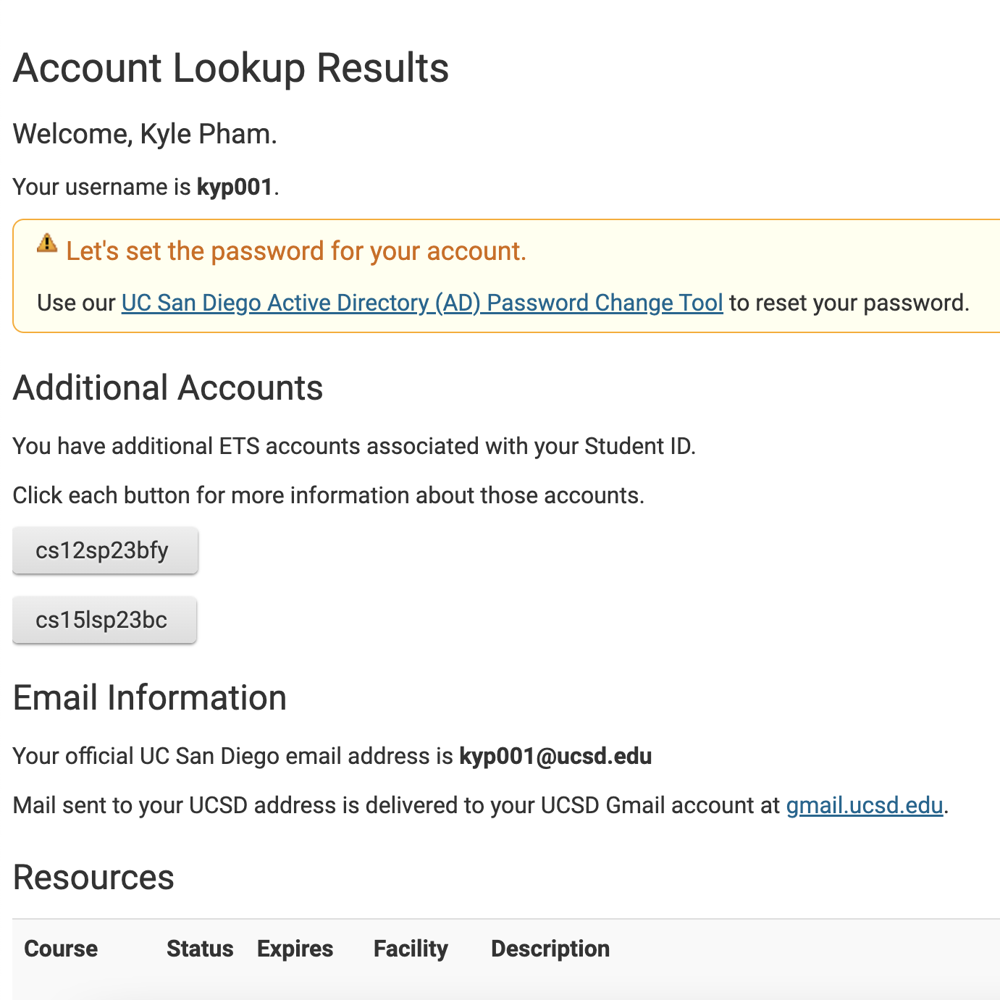
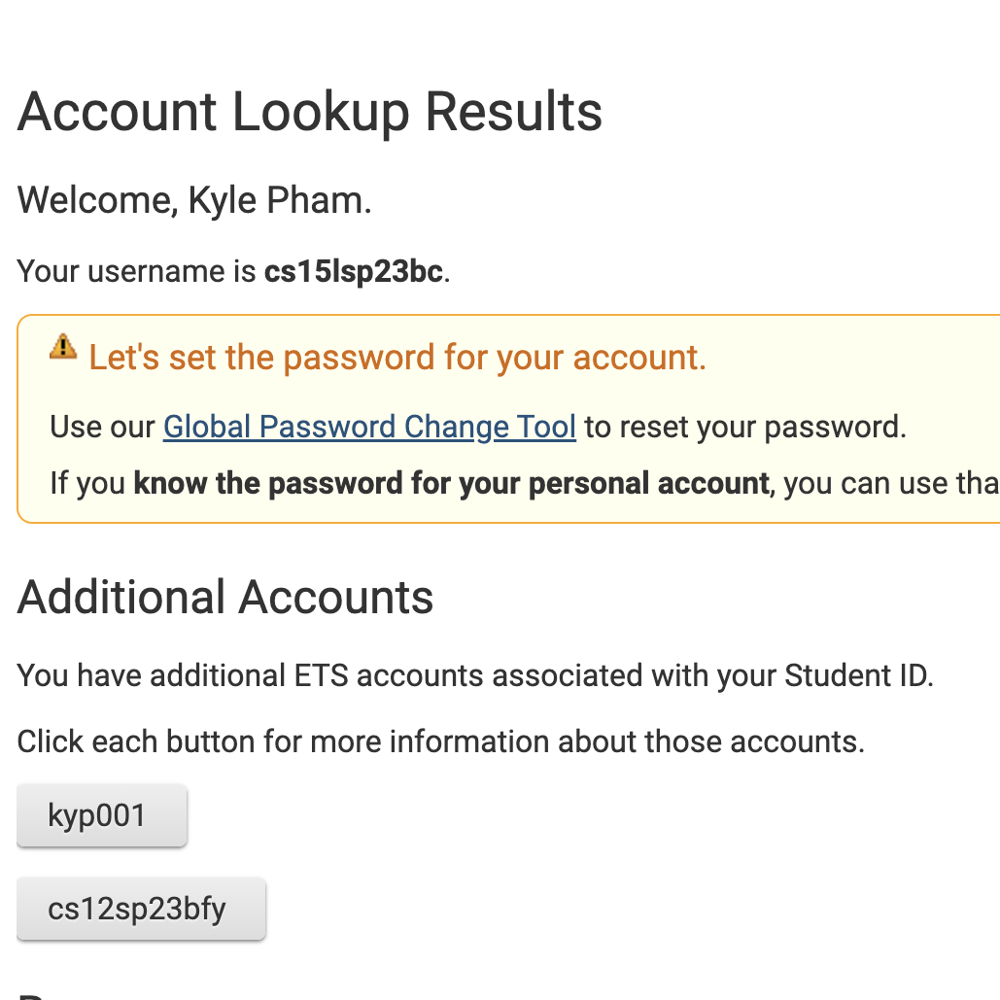
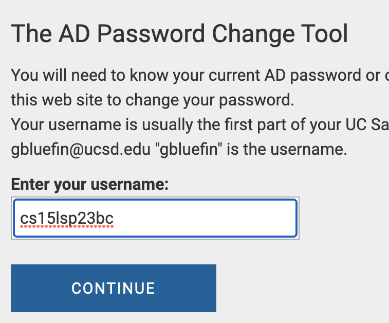
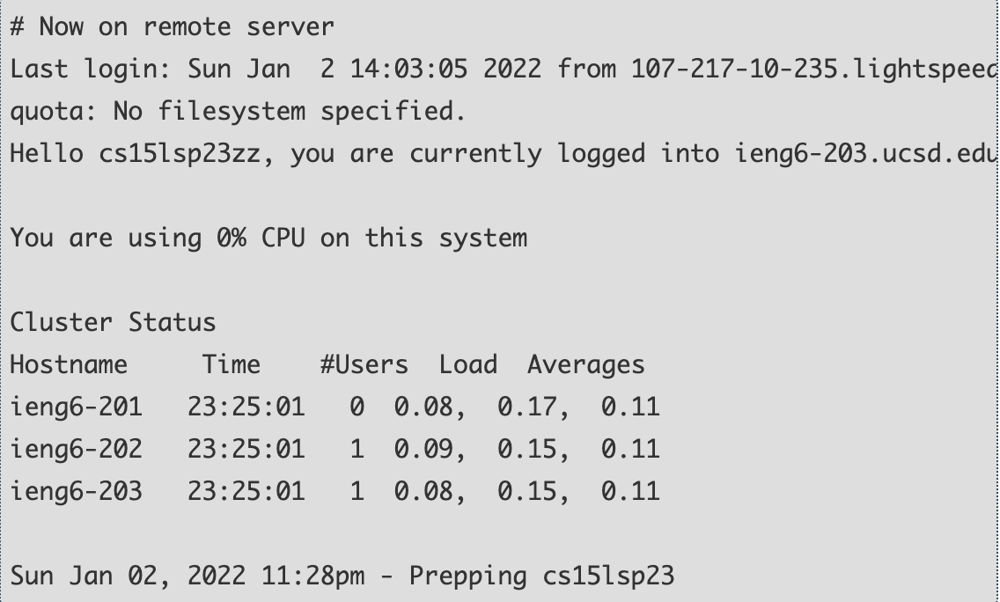
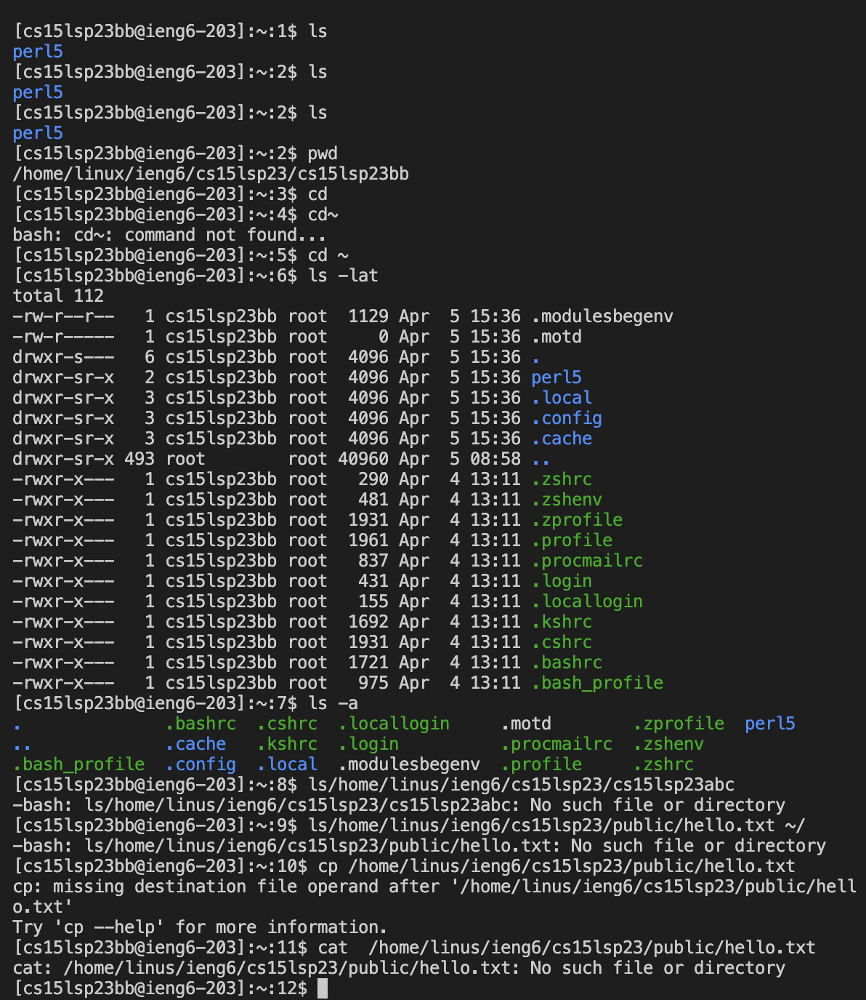

# How to tutorial for Github
## Step 1: Install VScode
* Go to [VScode Downloader](https://code.visualstudio.com/download)
* Then click on blue box "MAC" to download VScode
* 
* VScode should now be installed.
## Step 2: Find CSE15L Account
* Go to [Account Lookup](https://sdacs.ucsd.edu/~icc/index.php)
* Input both your User and Student ID then click "Submit"
* Then under "Additonal Accounts" you will find an account called "cs15l"
* 
* Click on that account and press on "Global Password Change Tool" to reset password.
* 
* Proceed to the Password Change Tool and input your cs15l username below.
* 
* Input your new password for your cs15l account. MAKE SURE YOU REMEMBER.
* Now you should be all set to remotely connect.
## Step 3: Remote Connect
* Open up VScode, then open the terminal
* Press Ctrl + ~ to open terminal
* Type in `ssh` and your "csl5l" email with "@ieng6.ucsd.edu"
* Press enter, and a yes/no question will show. Click yes
* Type in your password
* ![image]
* After this should pop up below
* 
* Your computer should now be connected
## Step 4: Trying Some Commands
* Time to try some commands
* List of commands
* `cd ~` Changes Directory to the given path
* `cd`
* `ls -lat`Shows the list of files/folders given
* `ls -a`
* Open up the terminal 
* Type in these commands
* If typed in correctly, your terminal should look like this
* 
* Now you are all done
* To exit out ther terminal press Ctrl + D

 
