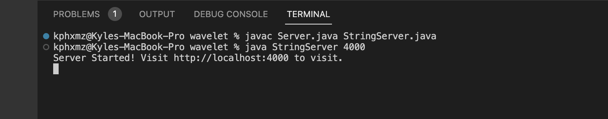
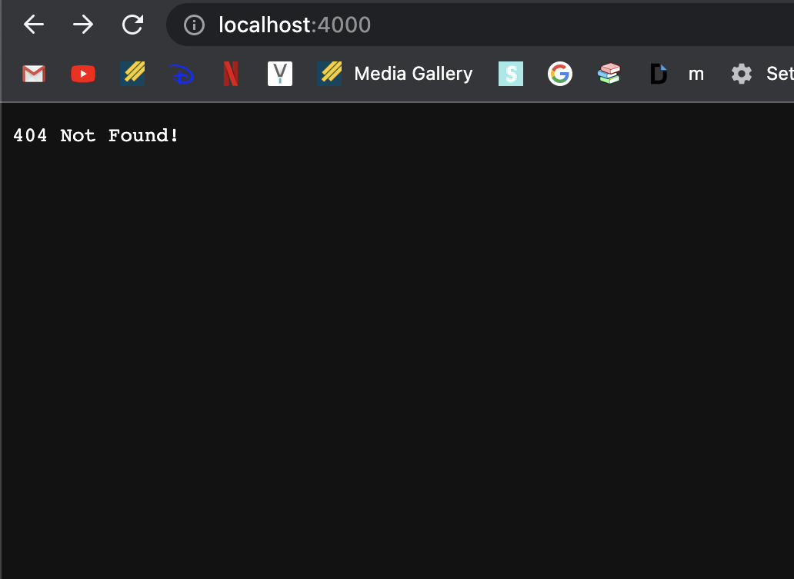
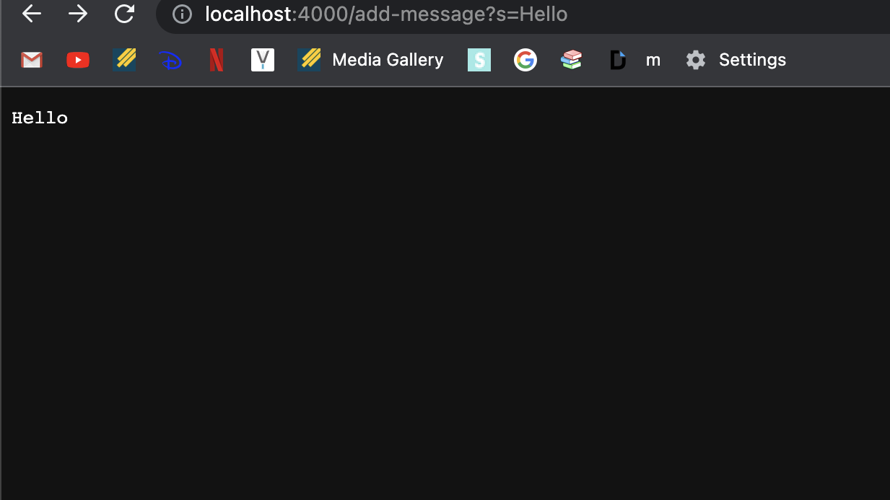
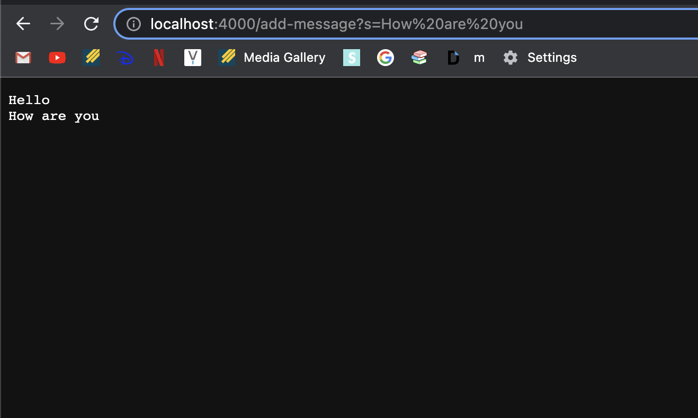

# Lab Report 2 - Servers and Bugs
## Part 1 - Write a web server called StringServer
* Code for StringServer
* `import java.io.IOException;`
* `import java.net.URI;`

class Handler implements URLHandler {

    String s;
    public String handleRequest(URI url) {
        if (url.getPath().contains("/add-message")) {
            String[] parameters = url.getQuery().split("=");
            String kp;
            if (s != null) {
                kp = s + "\n" + parameters[1];
                return kp;
            }
            s = parameters[1];
            return s;
        }
        return "404 Not Found!";
    }

    class StringServer {
        public static void main(String[] args) throws IOException {
            if(args.length == 0){
                System.out.println("Missing port number! Try any number between 1024 to 49151");
                return;
            }
    
            int port = Integer.parseInt(args[0]);
    
            Server.start(port, new Handler());
        }
    }
* After the completion of your code, you now want to run it in the terminal
* Open terminal on VScode with *Ctrl* + *~*  
* In your terminal type in the folowing commands
* `javac Server.java StringServer.java`
* `java StringServer 4000`
* If typed in correctly, this should appear below

* With the given linked, type the link into a search browser
* You will realize it will output "404 Not Found!"

* This is because there is no message given in the link, so it returns "404 Not Found!"
* To fix this add `/add-message?=<string>`
* The string can be anything, for example `/add-message?=Hello`
* Doing so, "Hello" should be the output when typing the new link

* The method `handleRequest` is called and passes the first two if statements, which returns the message "Hello"
* Next replace "Hello" with "How are you"
* Enter the new link and search
* You will see "Hello" and "How are you" is printed on the same link
* "How are you" printed under "Hello" due to `\n` creating a new line.

* The method `handleRequest` is called again and passes the first two if statements
* With being said, the `\n` was called resulting in the return of "How are you" in a new line.
