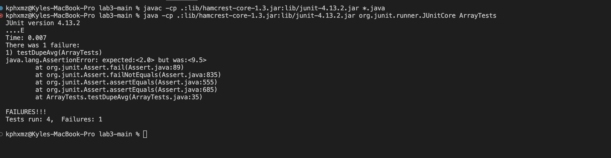

# Lab Report 2 - Servers and Bugs
## Part 1 - Write a web server called StringServer
* Code for StringServer

```
import java.io.IOException;
import java.net.URI;

class Handler implements URLHandler {

    String s;
    public String handleRequest(URI url) {
        if (url.getPath().contains("/add-message")) {
            String[] parameters = url.getQuery().split("=");
            String kp;
            if (s != null) {
                kp = s + "\n" + parameters[1];
                return kp;
            }
            s = parameters[1];
            return s;
        }
        return "404 Not Found!";
    }

    class StringServer {
        public static void main(String[] args) throws IOException {
            if(args.length == 0){
                System.out.println("Missing port number! Try any number between 1024 to 49151");
                return;
            }
    
            int port = Integer.parseInt(args[0]);
    
            Server.start(port, new Handler());
        }
    }
 ```
* After the completion of your code, you now want to run it in the terminal
* Open terminal on VScode with *Ctrl* + *~*  
* In your terminal type in the folowing commands
* `javac Server.java StringServer.java`
* `java StringServer 4000`
* If typed in correctly, this should appear below

* With the given linked, type the link into a search browser
* You will realize it will output "404 Not Found!"

* This is because there is no message given in the link, so it returns "404 Not Found!"
  * To fix this add `/add-message?=<string>`
  * The string can be anything, for example `/add-message?=Hello`
  * Doing so, "Hello" should be the output when typing the new link

* The method `handleRequest` is called and passes the first two if statements, which returns the message "Hello"
* Next replace "Hello" with "How are you"
  * Enter the new link and search
  * You will see "Hello" and "How are you" is printed on the same link
  * "How are you" printed under "Hello" due to `\n` creating a new line.

* The method `handleRequest` is called again and passes the first two if statements
  * With being said, the `\n` was called resulting in the return of "How are you" in a new line.
  * Notice how the values changes in link when adding "How are you"
  * You will see "%20" in between "How", "are", and "you" indicating the spaces

## Part 2 - Choosing a bug from Lab 3
* A failure inducing bug
```
  public void testDupeAvg() {
    double [] input1 = {2, 2, 2, 2, 2};
    assertEquals(2, ArrayExamples.averageWithoutLowest(input1), 0.001);
  }
```
* Input that does not induce a failure
```
public void testReversed2() {
    int[] input1 = { 4, 3, 2, 1};
    assertArrayEquals(new int[]{1, 2, 3, 4}, ArrayExamples.reversed(input1));
  }
  ```
* Output of running test cases

* Before code change
```
static int[] reversed(int[] arr) {
    int[] newArray = new int[arr.length];
    for(int i = 0; i < arr.length; i += 1) {
      arr[i] = newArray[arr.length - i - 1];
    }
    return arr;
  }
  ```
* After code change
  ```
  static int[] reversed(int[] arr) {
    int[] newArray = new int[arr.length];
    for(int i = 0; i < arr.length; i += 1) {
      newArray[i] = arr[arr.length - i - 1];
    }
    return newArray;
  }
  ```
* Description on why this fixes the issue
  * Notice we changed `arr[i]` to `newArray[i] = arr[arr.length - i -1]` in the for loop
  * This fixes it because newArray has no elements and arr will be filled up with empty elements.
  * The solution makes newArray be filled up with elements from arr from last to first.

## Part 3 - What I'ved learned/didn't know before
* There were many things I have learnt during these three weeks. Going back to week 2, I did not know how to run or make a numberServer. But with the help of week 2, I was able to gain familiarity for our lab 2 report. I learnt how to make a StringSever that showcases messages on a website.
